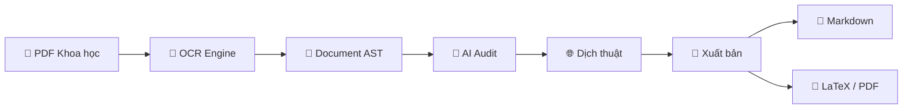
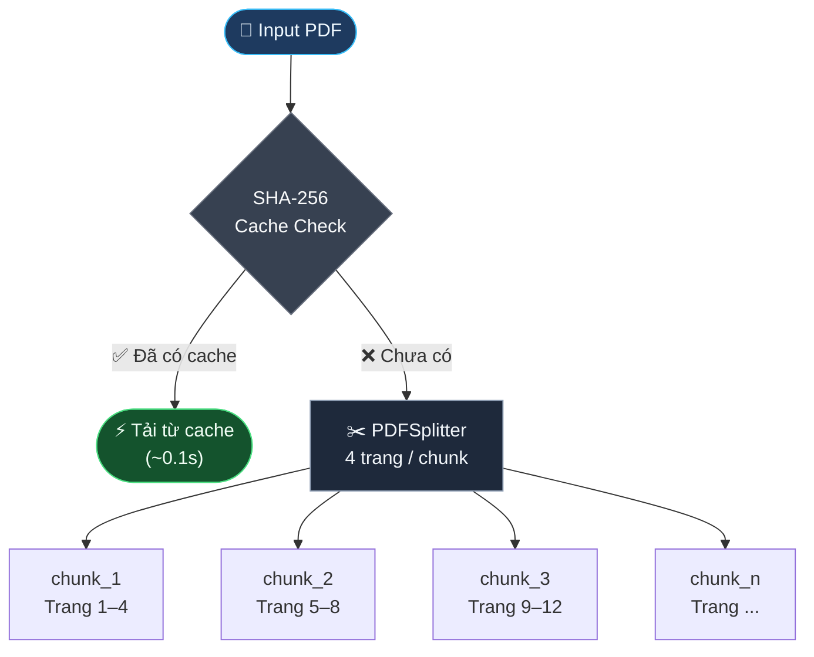
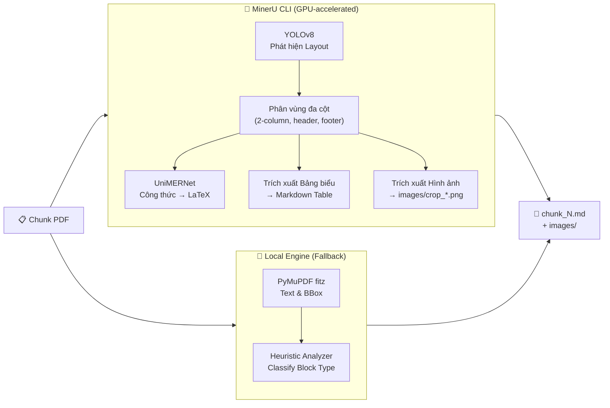
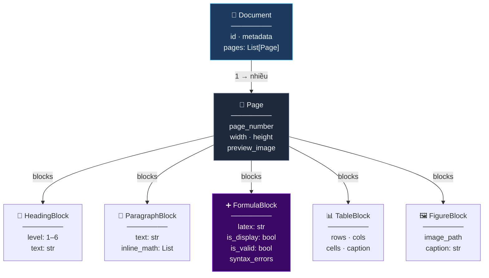
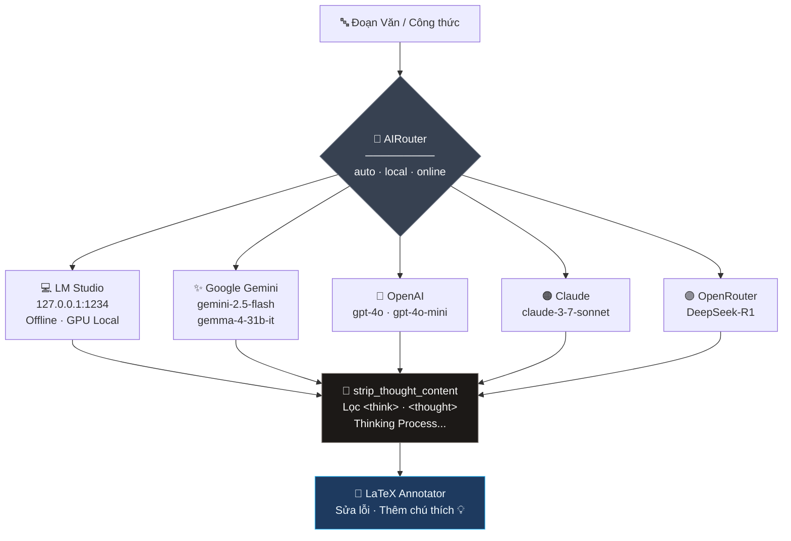
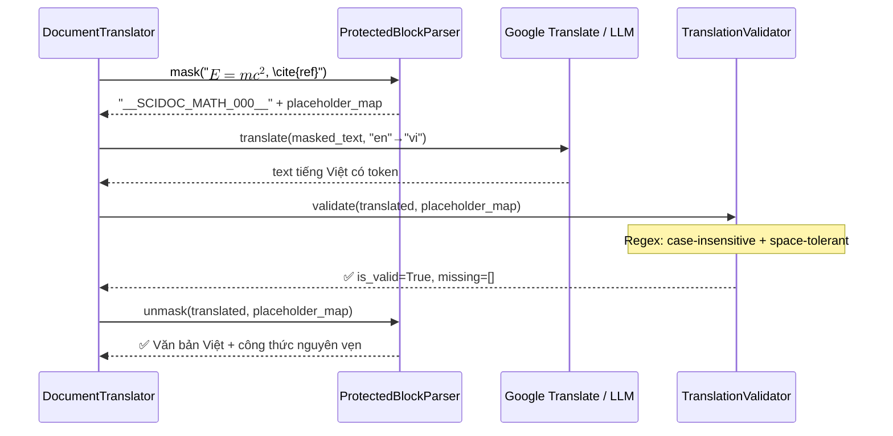
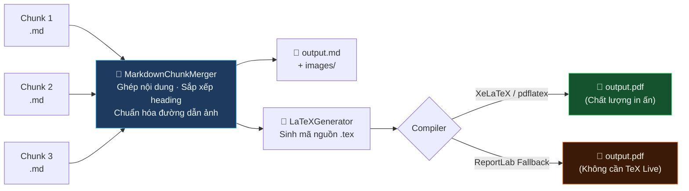
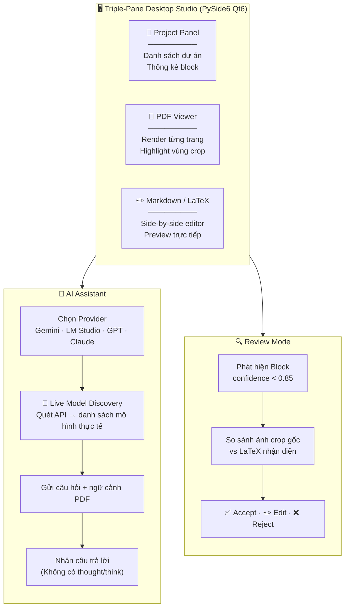

# 🔬 SciDoc OCR — Kiến trúc & Pipeline Xử lý Chi tiết

---

## Tổng quan hệ thống

---

## 1 · Nạp & Chia Chunk PDF

> **Tại sao chia 4 trang/chunk?**
> Giới hạn VRAM GPU — mô hình nhận diện công thức cần nhiều bộ nhớ. Chia chunk giúp tránh tràn RAM, cho phép phục hồi nếu một chunk gặp sự cố, và hiển thị tiến độ `25% → 50% → 75% → 100%` chính xác.

---

## 2 · OCR Layout & Công thức Toán học

---

## 3 · Cấu trúc Cây AST

---

## 4 · Bộ Điều phối AI (AIRouter)

---

## 5 · Dịch thuật Bảo toàn Công thức

> Validator sử dụng Regex `IGNORECASE` để nhận diện token dù bị đổi hoa thường, tránh cảnh báo `[WARNING] Translation dropped tokens` sai.

---

## 6 · Hợp nhất & Xuất bản Đa định dạng

---

## 7 · Giao diện Studio & Tính năng Tương tác

---

## Bảng tổng hợp công nghệ

| Giai đoạn | Module | Thư viện | Vai trò |
|---|---|---|---|
| Nạp PDF | `PDFSplitter` | PyMuPDF | Chia trang, render ảnh preview |
| Cache | `CacheManager` | SHA-256 + JSON | Tránh OCR lại trang đã xử lý |
| OCR chính | `MinerUService` | MinerU CLI | YOLOv8 layout + UniMERNet math |
| OCR dự phòng | `LocalOCRPipeline` | PyMuPDF + Heuristic | Bóc text vector, phân loại block |
| Kiểm tra Toán | `FormulaValidator` | SymPy | Kiểm cú pháp LaTeX, ngoặc cân bằng |
| Điều phối AI | `AIRouter` | httpx | Kết nối Gemini / OpenAI / LM Studio |
| Dịch thuật | `DocumentTranslator` | Google Translate | Dịch không giới hạn, bảo vệ công thức |
| Xác thực dịch | `TranslationValidator` | regex | Kiểm token không phân biệt hoa thường |
| Lọc suy nghĩ | `strip_thought_content` | re | Loại bỏ `<think>`, `Thinking Process` |
| Tạo LaTeX | `LaTeXGenerator` | Jinja2 template | Sinh `.tex` chuẩn AMSMath |
| Biên dịch | `LaTeXCompiler` | XeLaTeX / ReportLab | Xuất PDF chất lượng in ấn |
| Giao diện | `MainWindow` | PySide6 Qt6 | Dark-mode, bất đồng bộ QThread |
