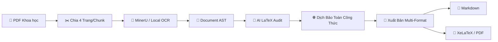

# ⚡ SciDoc OCR Studio — Scientific Document OCR & Publishing System

<div align="center">


### Hệ thống OCR Tài Liệu Khoa Học Đa Cột, Bóc Tách Công Thức Toán LaTeX, Dịch Thuật Bảo Toàn & Trợ Lý AI

[](https://www.python.org/)
[-green?logo=qt&logoColor=white)](https://pypi.org/project/PySide6/)
[](https://developer.nvidia.com/cuda-toolkit)
[](LICENSE)
[](tests/)

[Cài Đặt Nhanh](#-hướng-dẫn-cài-đặt--khởi-chạy-nhanh) • [Dành Cho Máy CPU](#-dành-cho-máy-tính-không-có-gpu-nvidia-cpu-only-mode) • [Hướng Dẫn Sử Dụng](#-hướng-dẫn-sử-dụng-từng-bước-user-guide) • [Cấu Hình & Chunking](#-lưu-ý-về-phân-bổ-trang--chunk-page--chunk) • [Kiến Trúc Pipeline](#-kiến-trúc-hệ-thống--pipeline-xử-lý) • [Thử Nghiệm Bản PRO](#-thử-nghiệm-phiên-bản-nâng-cấp-scidoc-ocr-pro-studio)

</div>

---

## 🚀 Hướng Dẫn Cài Đặt & Khởi Chạy Nhanh

Bạn có thể lựa chọn 1 trong 2 cách đơn giản sau để bắt đầu:

### 👉 Cách 1: Khởi chạy 1-Click bằng Script `run.bat` (Khuyên dùng nhất ⭐)
*Tiện lợi, an toàn, không bị Windows chặn tải file và tự động xử lý mọi thứ.*

1. Tải mã nguồn về máy: Bấm nút xanh **`Code`** ở đầu trang ➔ Chọn **`Download ZIP`** (hoặc Clone Git) và giải nén ra một thư mục.
2. **Double-click vào tệp `run.bat`**.
3. Hệ thống sẽ tự động kiểm tra và khởi động ứng dụng:
   - Nếu máy tính đã có đủ thư viện, ứng dụng **SciDoc OCR Studio** sẽ mở lên ngay lập tức!
   - Nếu máy tính chưa cài đặt thư viện, trình Launcher đồ họa sẽ tự động mở lên với 2 tùy chọn:
     - **`📦 Cài đặt CPU (Không cần GPU)`**: Dành cho laptop văn phòng, máy không có card rời (tải siêu tốc trong 5–10 giây).
     - **`⚡ Cài đặt GPU (MinerU CUDA)`**: Dành cho máy tính có card đồ họa rời NVIDIA.
     - Sau khi cài đặt xong, hệ thống tự động tạo biểu tượng **Shortcut ngoài màn hình Desktop** và mở ứng dụng!

---

### 👉 Cách 2: Chạy qua Dòng lệnh CLI (Dành cho Developer / Lập trình viên)
*Thao tác nhanh chóng qua môi trường dòng lệnh Terminal / CMD / PowerShell.*

```bash
# 1. Clone mã nguồn về máy
git clone https://github.com/Stufusic/SciDocOCR.git
cd SciDocOCR

# 2. Cài đặt bản nhẹ cho máy CPU (không cần GPU):
pip install uv
uv pip install -r requirements.txt

# (Tùy chọn) Cài đặt thêm MinerU Engine cho máy có card đồ họa NVIDIA GPU:
uv pip install -U "mineru[all]"

# 3. Khởi chạy ứng dụng Studio
python -m app.main
```

---

## 💻 Dành Cho Máy Tính Không Có GPU NVIDIA (CPU-Only Mode)

Nếu máy tính của bạn là **Laptop văn phòng, PC chỉ dùng CPU Intel / AMD hoặc card đồ họa onboard (iGPU)**, bạn **hoàn toàn yên tâm sử dụng 100% đầy đủ các tính năng** của SciDoc OCR Studio nhờ kiến trúc đám mây & hybrid thông minh:

### 🌟 Các Tính Năng Hoạt Động Hoàn Hảo Trên Máy CPU:
1. **📄 Bóc tách Bố cục & Công thức Toán học (Vector Heuristic OCR)**:
   - Tự động trích xuất toàn bộ văn bản đa cột, bảng biểu, hình ảnh và công thức toán trực tiếp từ PDF số hóa bằng CPU chỉ mất vài giây mỗi trang.
2. **🌐 Dịch thuật Bảo toàn Công thức Siêu tốc (Google Translate)**:
   - Dịch thuật toàn bộ tài liệu sang Tiếng Việt không giới hạn số trang, không cần GPU, bảo vệ 100% công thức toán học.
3. **🤖 Trợ lý AI Assistant Đám mây (Cloud AI)**:
   - Kết nối Google Gemini, OpenAI GPT, Claude, hoặc OpenRouter. Toàn bộ tính toán phức tạp chạy trên siêu máy chủ đám mây, máy tính của bạn chỉ nhận kết quả nên chạy cực kỳ mượt mà, không tốn RAM/CPU.
4. **📐 Xuất bản Markdown, Mã nguồn LaTeX & Biên dịch PDF**:
   - Tự động sinh file `.md`, `.tex` và xuất file PDF chất lượng cao.

### ⚙️ Thiết Lập Khuyến Nghị Cho Máy CPU:
Trong menu **`⚙ Settings`**:
- **`AI Engine Mode`**: Chọn **`Auto`** hoặc **`Online Only`**.
- **`Translation Engine`**: Chọn **`Google Translate`**.
- **`Active Provider`**: Chọn **`Google Gemini`** (tốc độ cao, hỗ trợ gói miễn phí) hoặc nhà cung cấp yêu thích của bạn.

---

## 📖 Hướng Dẫn Sử Dụng Từng Bước (User Guide)

Giao diện Studio được thiết kế theo cấu trúc 3 khung nhìn trực quan (**Triple-Pane Workspace**): Cây thư mục dự án (bên trái), Trình xem tài liệu PDF (ở giữa) và Trình biên tập Markdown / LaTeX / Chat Assistant (bên phải).

```
┌──────────────┬────────────────────────┬──────────────────────────────────────┐
│  Dự Án (Tree)│   Trình Xem PDF Gốc    │  Markdown  │  LaTeX  │ 💬 AI Assistant│
├──────────────┼────────────────────────┼──────────────────────────────────────┤
│ 📄 Page 1    │                        │                                      │
│ 📄 Page 2    │  [Hiển thị trang PDF   │  [Văn bản bóc tách & công thức toán  │
│ 📄 Page 3    │   kèm khung nhận diện] │   hiển thị trực tiếp theo thời gian  │
│ ...          │                        │   thực kèm hình ảnh và bảng biểu]    │
└──────────────┴────────────────────────┴──────────────────────────────────────┘
```

### Bước 1: Mở File PDF Khoa học
- Bấm vào nút **`📁 Open PDF`** trên thanh công cụ (Toolbar) và chọn tệp PDF cần xử lý.
- Hệ thống sẽ tự động tạo không gian làm việc và nạp các trang tài liệu vào danh sách.

### Bước 2: Bóc tách Bố cục & Nhận diện Công thức Toán (`⚡ Process All`)
- Bấm vào nút **`⚡ Process All`** trên thanh công cụ.
- Hệ thống sẽ tự động phân chia tài liệu theo từng chunk (4 trang/chunk), gọi động cơ OCR bóc tách văn bản đa cột, nhận diện công thức LaTeX và trích xuất hình vẽ vào thư mục `images/`.
- Tiến trình xử lý hiển thị trực tiếp ở thanh trạng thái phía dưới.

### Bước 3: Dịch thuật Bảo toàn Công thức (`🌐 Translate`)
- Bấm vào nút **`🌐 Translate`** trên thanh công cụ để dịch toàn bộ tài liệu sang ngôn ngữ đích (Tiếng Việt).
- Toàn bộ công thức toán học (`$$...$$`, `$x$`), mã nguồn và trích dẫn `\cite{}`, `\ref{}` được bảo vệ tuyệt đối và khôi phục nguyên vẹn 100% sau khi dịch.

### Bước 4: Tương tác với Trợ lý AI Hỏi đáp (`💬 AI Assistant`)
- Chuyển sang tab **`💬 AI Assistant`** ở khung bên phải:
  1. Chọn **Nhà cung cấp (Provider)**: Google Gemini, LM Studio (Local), OpenAI, Anthropic Claude, OpenRouter, hoặc Custom API.
  2. Hệ thống sẽ **tự động kết nối trực tiếp đến API để nạp toàn bộ danh sách mô hình mới nhất đang hoạt động** vào thanh cuộn chọn mô hình.
  3. Bấm **`⚙ API/URL`** nếu bạn muốn xem hoặc dán nhanh API Key / Base URL trực tiếp trong khung chat.
  4. Nhập câu hỏi về tài liệu, giải thích công thức toán hoặc yêu cầu tóm tắt. Câu trả lời được tự động lọc sạch các chuỗi suy nghĩ nội bộ để luôn ngắn gọn, chính xác.

### Bước 5: Soát lỗi Công thức có Độ tin cậy Thấp (`🔍 Review Mode`)
- Nếu tài liệu có các công thức mờ hoặc chất lượng scan kém, nút **`🔍 Review (N)`** ở thanh trạng thái phía dưới sẽ sáng lên.
- Bấm vào nút Review để mở cửa sổ đối soát: so sánh trực tiếp hình ảnh cắt từ PDF gốc với mã LaTeX nhận diện được, cho phép bạn Chấp nhận (**Accept**), Chỉnh sửa (**Edit**) hoặc Hủy bỏ (**Reject**).

### Bước 6: Xuất bản Đa Định dạng (`📤 Export...`)
- Bấm vào nút **`📤 Export...`** trên thanh công cụ.
- Tùy chọn định dạng cần xuất:
  - **Markdown (`.md`)**: Kèm toàn bộ thư mục hình ảnh `images/`.
  - **LaTeX Source (`.tex`)**: Mã nguồn LaTeX chuẩn hóa với các gói `amsmath`, `amssymb`, `graphicx`.
  - **Tài liệu PDF (`.pdf`)**: Tự động biên dịch qua XeLaTeX hoặc bộ tạo PDF tích hợp sẵn.

---

## ⚙️ Lưu Ý Về Phân Bổ Trang / Chunk (Page / Chunk)

Tài liệu khoa học thường rất nặng, chứa hàng trăm công thức ma trận, tích phân và sơ đồ mạng. Để tối ưu hóa hiệu năng, hệ thống áp dụng cơ chế **Phân mảnh thông minh (Smart 4-Page Chunking)**:

```
Tài liệu 14 Trang  ➔  [Chunk 1: Tr 1-4]  +  [Chunk 2: Tr 5-8]  +  [Chunk 3: Tr 9-12]  +  [Chunk 4: Tr 13-14]
```

### 🎯 Tại sao lại chia theo Chunk?
1. **Chống tràn bộ nhớ GPU VRAM**: Các mô hình AI phân tích bố cục và nhận diện công thức ngốn nhiều VRAM nếu nạp 20–50 trang cùng lúc. Chia chunk giữ mức VRAM luôn ổn định.
2. **Khả năng chịu lỗi (Fault-Tolerance)**: Nếu 1 trang trong tài liệu gặp sự cố, các chunk còn lại vẫn được lưu nguyên vẹn vào bộ nhớ đệm Cache SHA-256.
3. **Tối ưu Timeout (600 giây)**: Mỗi chunk được cấp hạn mức thời gian xử lý lên tới 10 phút, đảm bảo ngay cả những trang toán học phức tạp nhất cũng được giải mã hoàn chỉnh.

### 📊 Bảng Khuyến Nghị Cấu Hình Phần Cứng:

| Cấu hình Phần cứng | Dung lượng VRAM | Khuyến nghị Chunk Size | Ghi chú |
| :--- | :--- | :---: | :--- |
| **Máy chỉ dùng CPU** | RAM 8GB–16GB | `2 – 4 trang` | Xử lý ổn định, tiết kiệm RAM |
| **GPU Laptop (RTX 3050 / 4050 / 4060)** | VRAM 4GB – 8GB | `4 trang (Mặc định)` | Tối ưu hóa tốc độ và bộ nhớ VRAM |
| **GPU Desktop Cao cấp (RTX 3090 / 4090)** | VRAM 16GB – 24GB | `8 – 12 trang` | Tốc độ xử lý hàng loạt siêu nhanh |

---

## 🛠️ Hướng Dẫn Cấu Hình Chi Tiết (Settings Guide)

Bạn có thể cấu hình nhanh các tham số qua giao diện **`⚙ Settings`** trên thanh công cụ:

```
┌──────────────────────────────────────────────────────────────────┐
│                     SciDoc OCR - Settings                        │
├──────────────────────────────────────────────────────────────────┤
│ AI Engine Mode:      [ Auto (Tự động nhận diện)               ▼] │
│ Translation Engine:  [ Google Translate (Miễn phí / Tốc độ cao)▼]│
│ Active Provider:     [ Google Gemini / OpenAI / Claude / LM...▼] │
│ API Key:             [ ••••••••••••••••••••••••••••••••••••••  👁]│
│ Base URL:            [ Endpoint URL của nhà cung cấp API...     ]│
│ Model:               [ (Tự động nạp danh sách model trực tiếp) ▼]│
└──────────────────────────────────────────────────────────────────┘
```

### 1. Các Chế Độ Động Cơ AI (`AI Engine Mode`):
- **`Auto` (Mặc định - Khuyên dùng)**: Tự động phát hiện mạng và phần cứng. Ưu tiên GPU cục bộ, nếu không có sẽ tự động fallback qua API Online.
- **`MinerU`**: Sử dụng trực tiếp động cơ MinerU CLI cục bộ với tăng tốc NVIDIA CUDA GPU.
- **`LM Studio (Local Only)`**: Kết nối trực tiếp máy chủ LM Studio offline (`http://127.0.0.1:1234/v1`) bảo mật dữ liệu tuyệt đối.
- **`Online Only`**: Sử dụng các nhà cung cấp đám mây (Google Gemini, OpenAI, Claude, OpenRouter).

### 2. Quản Lý Khóa API & Danh Sách Mô Hình Động (Live Model Discovery):
- Hỗ trợ nhập và lưu trữ độc lập khóa API cho từng nhà cung cấp.
- Khi chuyển đổi giữa các nhà cung cấp, khóa API và Base URL đã lưu **không bao giờ bị mất** và tự động đồng bộ vào tệp `.env`.
- **Tự động quét danh sách mô hình thực tế**: Khi bạn chọn nhà cung cấp và nhập API key, hệ thống kết nối trực tiếp đến máy chủ để lấy toàn bộ danh sách model đang hoạt động mà không dùng danh sách cố định cũ.

### 3. Động Cơ Dịch Thuật (`Translation Engine`):
- **`Google Translate`**: Dịch thuật tốc độ cực cao, hoàn toàn miễn phí, không yêu cầu API Key và không giới hạn Quota.
- **`AI LLM Translation`**: Dịch thuật nâng cao qua mô hình ngôn ngữ lớn kết hợp tự động tạo chú thích giải thích công thức toán học (`> 💡`).

---

## 🌟 Tính Năng Nổi Bật

- 🔬 **Nhận diện Bố cục Đa Cột & Bảng biểu**: Bóc tách tài liệu 2 cột, căn lề, hình vẽ và bảng biểu phức tạp.
- ➕ **Trích xuất Công thức LaTeX Chuyên sâu**: Nhận diện chính xác công thức toán trong dòng (`$x$`) và khối (`$$...$$`), kiểm tra cú pháp bằng SymPy.
- 🛡️ **Bảo toàn Công thức 100% khi Dịch thuật (`ProtectedBlockParser`)**: Tự động mã hóa toàn bộ `$$...$$`, `$x$`, `\cite{}`, `\ref{}` trước khi gửi dịch và đối soát khôi phục nguyên vẹn sau dịch.
- 💬 **Trợ lý AI Chat Assistant**: Khung chat tương tác trực tiếp theo ngữ cảnh PDF, hỗ trợ chọn model động và tự động lọc sạch các khối suy nghĩ nội bộ (`<think>`, `<thought>`).
- 📐 **Biên dịch Xuất bản Đa Định dạng**: Xuất file Markdown sạch, mã nguồn LaTeX (`.tex`) và tự động biên dịch tài liệu PDF chất lượng cao qua XeLaTeX.

---

## 🏗️ Kiến trúc Hệ thống & Pipeline Xử lý

> 📖 **Xem toàn bộ sơ đồ tuần tự (Sequence Diagram), sơ đồ lớp AST (Class Diagram) và chi tiết 7 giai đoạn xử lý tại:** [**PIPELINE.md**](PIPELINE.md)



---

## 📦 Hướng Dẫn Đóng Gói Phân Phối

Bạn có thể tự đóng gói ứng dụng thành file `.exe` cho Windows:

```bash
# 1. Đóng gói Launcher 1-Click siêu nhẹ (~13 MB):
python build_launcher.py

# 2. Đóng gói toàn bộ ứng dụng chính thành 1 file độc lập:
python build_exe.py
```
> Kết quả xuất bản sẽ nằm trong thư mục `dist/`.

---

## 💻 Yêu Cầu Hệ Thống (System Requirements)

- **Hệ điều hành**: Windows 10 / 11 (64-bit).
- **Python**: Python 3.11, 3.12 hoặc 3.13.
- **Bộ nhớ RAM**: Tối thiểu 8 GB RAM (Khuyến nghị 16 GB).
- **Card đồ họa (Tùy chọn)**: Hỗ trợ card NVIDIA (CUDA 12.x) để tăng tốc nhận diện công thức toán học.

---

## 🌟 Thử Nghiệm Phiên Bản Nâng Cấp: SciDoc OCR PRO Studio (v1.0.1)

Nếu bạn muốn trải nghiệm phiên bản nâng cấp thế hệ mới với giao diện đồ họa hiện đại, công nghệ AI Vision đa phương thức và bộ cài đặt Windows Setup Wizard chạy thuần máy tính (Zero-Port Native App):

* ⬇️ **Tải Bản Cài Đặt Setup Windows (.exe):** [Release SciDoc OCR PRO Studio (exe) v1.0.1 - Windows Release](https://github.com/Stufusic/SciDocOCR/releases/tag/v1.0.1)
* 📦 **Kho Mã Nguồn Bản PRO:** (Đóng)

### 💎 Các Tính Năng Nổi Bật Bản PRO:
1. **🖥️ Kiến Trúc Native Desktop App (Zero-Port JS Bridge IPC):** Chạy trực tiếp 100% trong bộ nhớ máy tính qua JS Bridge IPC (`window.pywebview.api`), không mở cổng Port, không dùng máy chủ web, triệt tiêu 100% lỗi mạng và firewall.
2. **📦 Trình Cài Đặt 1-Click Setup Wizard (`SciDocOCR_Pro_Setup_v1.0.1.exe`):** Tải về, bấm Next $\to$ Finish là app tự động chạy mượt mà ngay trên máy.
3. **✂️ Phân Tách 3 Trang Thông Minh & Tự Phục Hồi (Adaptive 3-Page Chunking & Checkpoints):** Tối ưu hóa ngữ cảnh và bộ nhớ, tự lưu & khôi phục checkpoint từng khối.
4. **🎨 Khoanh Vùng & Tự Chỉnh Bounding Box Trực Tiếp Trên PDF:** Kéo thả khung nhận diện trực quan trên bản PDF gốc.
5. **➕ Thêm Khối Mới Tùy Chỉnh (`+ Thêm Khối`):** Khoanh vùng bất kỳ và gọi AI OCR trích xuất công thức LaTeX / bảng số liệu tức thì.
6. **🌐 Dịch Thuật Chuyên Ngành Song Ngữ (Dual-View Bilingual Translation):** Đối sánh trực quan bản gốc & bản dịch Tiếng Việt, bảo toàn 100% công thức toán học.
7. **🤖 Tích Hợp Đa Nhà Cung Cấp LLM AI & Live Model Discovery:** Kết nối Google Gemini, OpenAI, Claude, OpenRouter, Local AI với tính năng Fetch Models tự động.
8. **📊 Bóc Tách Bảng Biểu Chuẩn Quốc Tế (Booktabs):** Tái tạo bảng số liệu sang cả Markdown và mã nguồn LaTeX chuẩn mực.

---

### 🔑 Hướng Dẫn Lấy & Cấu Hình API Key Cho Các LLM AI:
* **Google Gemini API Key (Miễn phí 100% ⭐):** Truy cập [Google AI Studio (https://aistudio.google.com/)](https://aistudio.google.com/) ➔ Bấm **Get API key** ➔ Tạo key và dán vào ô **Google API Key** trong phần Cài đặt của ứng dụng.
* **OpenRouter API Key (Truy cập 200+ Model: DeepSeek-R1, Qwen, Claude):** Truy cập [OpenRouter Keys (https://openrouter.ai/keys)](https://openrouter.ai/keys) ➔ Tạo key và dán vào ô **OpenRouter API Key** trong ứng dụng.
* **OpenAI API Key (GPT-4o, o3-mini):** Truy cập [OpenAI Platform (https://platform.openai.com/api-keys)](https://platform.openai.com/api-keys) ➔ Tạo key và dán vào ô **OpenAI API Key**.
* **Anthropic Claude API Key (Claude 3.7 Sonnet):** Truy cập [Anthropic Console (https://console.anthropic.com/)](https://console.anthropic.com/) ➔ Lấy key và dán vào ô **Anthropic API Key**.
* **Local AI Offline (Ollama / LM Studio - Không cần Key):** Điền Base URL `http://127.0.0.1:11434/v1` (Ollama) hoặc `http://127.0.0.1:1234/v1` (LM Studio).

---

## 📄 Bản quyền (License)

Dự án được phát hành theo giấy phép mã nguồn mở **[MIT License](LICENSE)**. Tự do sử dụng, tùy biến và phân phối cho mục đích học tập cũng như thương mại.
