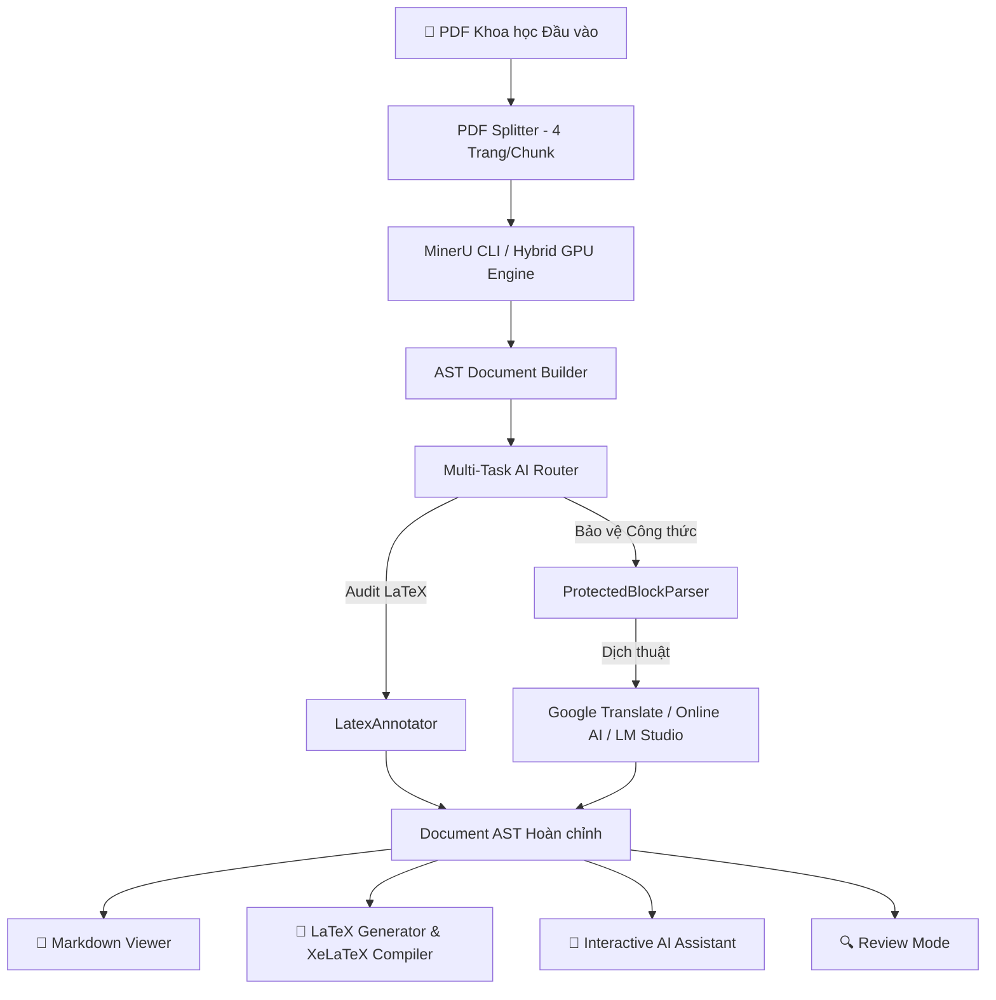

# ⚡ SciDoc OCR Studio - Scientific Document OCR & Publishing System

<div align="center">


-green?logo=qt)


**Hệ thống bóc tách, nhận diện tài liệu khoa học đa cột, trích xuất công thức LaTeX, dịch thuật bảo toàn và biên dịch xuất bản chuyên nghiệp.**

[Tính năng](#-tính-năng-nổi-bật) • [Cài đặt 1-Click](#-hướng-dẫn-cài-đặt--chạy-nhanh) • [Khung Chat AI](#-trợ-lý-ai-assistant) • [Kiến trúc hệ thống](#-kiến-trúc-hệ-thống) • [Đóng gói EXE](#-đóng-gói-file-exe)

</div>

---

## 🌟 Tính năng Nổi bật

### 1. 🔬 Bóc tách Layout & Công thức Toán học Chuyên sâu (MinerU Engine + Local OCR)
- Hỗ trợ tài liệu khoa học phức tạp: bài báo 2 cột, bảng biểu, biểu đồ, header/footer, chú thích.
- Bóc tách công thức Toán trong dòng (`inline math` `$x$`) và khối (`display math` `$$...$$`).
- Cơ chế cắt chia chunk thông minh **4 trang/chunk** tránh tràn RAM/VRAM, hỗ trợ tăng tốc **NVIDIA CUDA GPU**.

### 2. 🤖 AI Dual-Engine & Bộ Điều phối Thông minh (AIRouter)
- **Local AI (Offline)**: Kết nối trực tiếp **LM Studio** (`qwen/qwen3.5-9b`, `deepseek-r1`, `llama-3.3-70b`...).
- **Online AI (Multi-Provider)**: Tích hợp **Google Gemini** (`gemini-2.5-flash`, `gemini-2.0-flash`, `gemma-4-31b-it`), **OpenAI** (`gpt-4o`), **Anthropic Claude** (`claude-3-7-sonnet`), và **OpenRouter / DeepSeek**.
- Tự động quét và nạp danh sách model trực tiếp từ API (Live Model Discovery).
- Lưu trữ API Key vĩnh viễn và tự động nạp khi mở lại ứng dụng.

### 3. 🌐 Động cơ Dịch thuật Bảo toàn Công thức (Formula-Preserving Translation)
- **Google Translate Engine (Miễn phí & Siêu tốc)**: Dịch toàn bộ tài liệu nhanh chóng mà không cần API Key, không giới hạn Quota.
- **LLM AI Translation**: Dịch thuật nâng cao kết hợp tự động gắn chú thích giải thích công thức `> 💡`.
- Bộ đệm `ProtectedBlockParser` mã hóa bảo vệ toàn bộ `$$...$$`, `$x$`, `\cite{}`, `\ref{}` trước khi dịch và khôi phục nguyên vẹn 100%.

### 4. 💬 Trợ lý AI Chat Đa Mô hình (`AI Assistant`)
- Khung chat tương tác trực tiếp với tài liệu PDF hiện tại.
- Chọn nhanh mô hình (Gemini, LM Studio, GPT-4o, Claude, DeepSeek).
- Tự động lọc sạch các chuỗi suy nghĩ nội bộ (`<think>`, `<thought>`, `Thinking Process`) để câu trả lời luôn ngắn gọn, chính xác.
- Hỗ trợ định dạng Markdown và công thức LaTeX Math trực quan.

### 5. 📐 Xuất bản Đa Định dạng (Publishing Studio)
- Xuất file **Markdown** sạch kèm thư mục hình ảnh `images/`.
- Xuất mã nguồn **LaTeX (`.tex`)** hoàn chỉnh với các gói `amsmath`, `amssymb`, `graphicx`.
- Tự động biên dịch ra **PDF** qua XeLaTeX / pdflatex hoặc bộ tạo PDF fallback tích hợp sẵn.

---

## 🚀 Hướng dẫn Cài đặt & Chạy Nhanh

### Cách 1: Chạy trực tiếp bằng Launcher 1-Click (Khuyên dùng)
Double-click vào file **`run.bat`** hoặc chạy launcher:
```bash
python launcher.py
```
> Trình Launcher sẽ tự động kiểm tra máy tính của bạn, tải các thư viện còn thiếu bằng công cụ `uv` siêu tốc và mở giao diện ứng dụng.

---

### Cách 2: Cài đặt qua dòng lệnh

1. **Clone repository**:
```bash
git clone https://github.com/your-username/SciDocOCR.git
cd SciDocOCR
```

2. **Cài đặt thư viện phụ thuộc**:
```bash
# Cài đặt bằng uv (Khuyên dùng - chỉ mất 5-10 giây)
pip install uv
uv pip install -r requirements.txt

# (Tùy chọn) Cài đặt thêm MinerU Engine nếu muốn chạy OCR offline
uv pip install -U "mineru[all]"
```

3. **Khởi chạy ứng dụng**:
```bash
python -m app.main
```

---

## 🏗️ Kiến trúc Hệ thống & Pipeline Xử lý

> 📖 **Xem tài liệu chi tiết đầy đủ với các sơ đồ Sequence, Class Diagram và Flowchart tại:** [**PIPELINE.md**](PIPELINE.md)



---

## 📦 Đóng gói File `.exe` Phân phối

Bạn có thể dễ dàng đóng gói ứng dụng thành file `.exe` cho Windows:

### 1. Đóng gói Launcher Cài đặt Tự động (`SciDocOCR-Launcher.exe`):
```bash
python build_launcher.py
```
File thực thi sẽ được xuất tại thư mục: `dist/SciDocOCR-Launcher/SciDocOCR-Launcher.exe`.

### 2. Đóng gói Ứng dụng Chính (`SciDocOCR.exe`):
```bash
python build_exe.py
```
File thực thi độc lập sẽ được xuất tại: `dist/SciDocOCR.exe`.

---

## 🧪 Kiểm thử Đơn vị (Unit Tests)

Hệ thống đi kèm bộ kiểm thử tự động toàn diện với **35 bài test**:
```bash
python -m pytest tests/ -v
```

---

## 📄 Bản quyền (License)
Dự án được phát hành theo giấy phép **MIT License**. Tự do sử dụng, chỉnh sửa và phân phối cho mục đích học tập và thương mại.