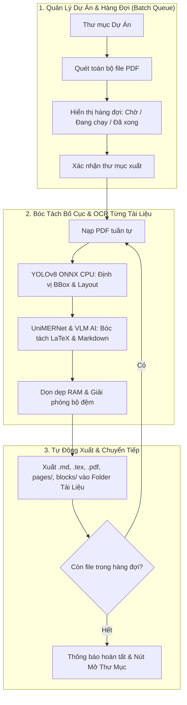

# ⚡ SciDoc OCR Studio v1.0.1 — Scientific Document OCR & Publishing System

<div align="center">


### Hệ thống OCR Tài Liệu Khoa Học Đa Cột, Bóc Tách Công Thức Toán LaTeX, Dịch Thuật Bảo Toàn & Trợ Lý AI

[](https://github.com/Stufusic/SciDocOCR/releases)
[](https://www.python.org/)
[-green?logo=qt&logoColor=white)](https://pypi.org/project/PySide6/)
[-orange?logo=onnx&logoColor=white)](https://onnxruntime.ai/)
[](LICENSE)
[](tests/)

[⬇️ Tải Bản Release](#-tải-về-bản-phát-hành-mới-nhất-releases) • [Cài Đặt Nhanh](#-hướng-dẫn-cài-đặt--khởi-chạy-nhanh) • [Chế Độ CPU Only](#-dành-cho-máy-tính-không-có-gpu-nvidia-cpu-only-mode) • [Hướng Dẫn Sử Dụng](#-hướng-dẫn-sử-dụng-chi-tiết-user-guide) • [Kiến Trúc Pipeline](#-kiến-trúc-pipeline-v101--xử-lý-tự-động-hàng-loạt) • [Thử Nghiệm Bản PRO](#-thử-nghiệm-phiên-bản-nâng-cấp-scidoc-ocr-pro-studio-v103)

</div>

---

## 🚀 Điểm Mới Trong Phiên Bản v1.0.1

* ⚡ **Quy Trình Dự Án & Xử Lý Tự Động Hàng Loạt ("Process All")**: Nút **⚡ Process All** xuất hiện theo ngữ cảnh khi mở Thư mục Dự Án (`Open Project`). Hệ thống tự động quét toàn bộ tệp PDF, cho phép chọn vị trí xuất, sau đó tự động nạp tuần tự từng tài liệu từ trên xuống, bóc tách OCR và xuất trọn bộ vào thư mục riêng mang tên tài liệu đó rồi tự động nạp tài liệu tiếp theo.
* 👁️ **Động Cơ Thị Giác YOLOv8 Layout & UniMERNet Math OCR**: Định vị phân vùng bố cục chuẩn xác và giải mã công thức toán học chuyên sâu sang LaTeX chuẩn.
* 📦 **Module Tiện Ích Dùng Chung Chuẩn Hóa (`app/utils/common.py`)**: Tối ưu hóa toàn bộ codebase, gom các hàm xử lý ảnh độ phân giải cao cho Vision AI/LM Studio (`optimize_image_for_ai`), mã hóa Base64 Data URI, dọn rác và bộ nhớ đệm (`purge_directory`, `sanitize_filename`), lọc triệt để suy nghĩ nội bộ (`strip_thought_content`), băm SHA-256 và logging.
* 🔄 **Cơ Chế Dự Phòng & Tự Động Xoay Vòng Model AI (Dynamic Failover)**: Tự động phát hiện model AI gặp sự cố (timeout, rate-limit, lỗi mạng) để chuyển sang model dự phòng ngay lập tức và ghi nhớ model hoạt động tốt nhất.
* 🌐 **Dịch Thuật Markdown Siêu Tốc 1500 Ký Tự**: Hỗ trợ chia nhỏ văn bản theo từng khối ~1500 ký tự và stream trực tiếp lên giao diện, hỗ trợ cả **Google Translate** miễn phí và **AI LLM** với danh sách ngôn ngữ hiển thị đầy đủ tên quốc gia.
* 📤 **Xuất Trọn Bộ Tài Liệu (Dedicated Export Bundle)**: Tùy chọn vị trí xuất bất kỳ, gom toàn bộ asset chuyển đổi (`.md`, `.tex`, `.pdf`, `_ast.json`) và thư mục ảnh `images/`, `pages/`, `blocks/` vào một thư mục chuyên biệt.

---

## ⬇️ Tải Về Bản Phát Hành Mới Nhất (Releases)

Bạn có thể tải ngay bản phát hành đóng gói sẵn cho Windows:

* 📦 **Tải Bản Release Chính Thức:** [**SciDoc OCR Studio Releases on GitHub**](https://github.com/Stufusic/SciDocOCR/releases)
* 🚀 **Trình Khởi Chạy Nhanh:** Tải file `SciDocOCR_Launcher.exe` hoặc file nén `SciDocOCR_Windows.zip`, giải nén và mở trực tiếp để sử dụng ngay!

---

## 🛠️ Hướng Dẫn Cài Đặt & Khởi Chạy Nhanh

Bạn có thể lựa chọn 1 trong 3 cách sau để bắt đầu:

### 👉 Cách 1: Khởi chạy 1-Click bằng Script `run.bat` (Khuyên dùng nhất ⭐)
*Tiện lợi, an toàn, tự động kiểm tra thư viện và nạp môi trường tối ưu.*

1. Tải mã nguồn về máy: Bấm nút xanh **`Code`** ở đầu trang ➔ Chọn **`Download ZIP`** (hoặc Clone Git) và giải nén ra một thư mục.
2. **Double-click vào tệp `run.bat`**.
3. Giao diện **Setup Wizard / Smart Launcher** sẽ tự động mở lên với các tùy chọn tiện ích:
   - **`📦 Cài đặt CPU (Không cần GPU)`**: Dành cho laptop văn phòng, máy không có card rời (cài đặt siêu tốc trong vài giây).
   - **`⚡ Cài đặt GPU (MinerU CUDA)`**: Dành cho máy tính có card đồ họa rời NVIDIA.
   - **`📥 Tải YOLOv8 Layout (~45MB)`**: Tải model YOLOv8 DocLayout bóc tách phân vùng bố cục trực tiếp từ CDN/HuggingFace về máy.
   - **`📥 Tải UniMERNet Math (~115MB)`**: Tải model UniMERNet nhận diện công thức toán học chuyên sâu.
   - **`🚀 Khởi chạy SciDoc OCR`**: Tự động tạo biểu tượng **Desktop Shortcut** và mở ứng dụng ngay!

---

### 👉 Cách 2: Sử Dụng Setup Wizard / Launcher (.exe)
*Dành cho người dùng thích cài đặt qua giao diện đồ họa chuẩn Windows.*

1. Tải file `SciDocOCR_Launcher.exe` từ [GitHub Releases](https://github.com/Stufusic/SciDocOCR/releases).
2. Mở file để khởi chạy Setup Wizard.
3. Bấm **Tải YOLOv8 Layout** & **UniMERNet Math**, sau đó bấm **Khởi chạy**.

---

### 👉 Cách 3: Chạy qua Dòng lệnh CLI (Dành cho Developer / Lập trình viên)
*Thao tác nhanh chóng qua Terminal / CMD / PowerShell.*

```bash
# 1. Clone mã nguồn về máy
git clone https://github.com/Stufusic/SciDocOCR.git
cd SciDocOCR

# 2. Cài đặt các gói phụ thuộc (Khuyên dùng uv để đạt tốc độ tối đa):
pip install uv
uv pip install -r requirements.txt

# (Tùy chọn) Cài đặt thêm MinerU GPU Engine nếu có card NVIDIA:
uv pip install -U "mineru[all]"

# 3. Khởi chạy ứng dụng Studio
python -m app.main
```

---

## 💻 Dành Cho Máy Tính Không Có GPU NVIDIA (CPU-Only Mode)

Nếu máy tính của bạn là **Laptop văn phòng, PC chỉ dùng CPU Intel / AMD hoặc card đồ họa onboard (iGPU)**, bạn **hoàn toàn yên tâm sử dụng 100% đầy đủ các tính năng** của SciDoc OCR Studio nhờ kiến trúc phân tầng tối ưu:

### 🌟 Các Tính Năng Hoạt Động Hoàn Hảo Trên Máy CPU:
1. **⚡ Định Vị Bố Cục Bằng YOLOv8 ONNX Trên CPU**:
   - Sử dụng mô hình **YOLOv8 DocLayout** kết hợp `onnxruntime` (`CPUExecutionProvider`) để phân vùng Layout (Section, Heading, Paragraph, Table, Formula) với tốc độ siêu nhanh **~20ms – 35ms / trang**.
   - Nếu chưa tải file ONNX, hệ thống tự động fallback sang thuật toán **CV & Typography Heuristic Engine** có sẵn trong app $\rightarrow$ không bao giờ bị lỗi thiếu file.
2. **🤖 Bóc Tách OCR Chuyên Sâu Bằng VLM (Online API hoặc Local Model)**:
   - Các khung Section được tối ưu hóa ảnh và chuyển tới mô hình Vision-Language (Google Gemini, OpenAI GPT-4o, Claude hoặc LM Studio Local) để **chỉ tập trung OCR giải mã nội dung và công thức LaTeX** trong từng khung Section đó.
   - Nếu chưa tải file ONNX, hệ thống tự động fallback sang thuật toán **CV & Typography Heuristic Engine** có sẵn trong app $\rightarrow$ không bao giờ bị lỗi thiếu file.
2. **🤖 Bóc Tách OCR Chuyên Sâu Bằng VLM (Online API hoặc Local Model)**:
   - Các khung Section được tối ưu hóa ảnh và chuyển tới mô hình Vision-Language (Google Gemini, OpenAI GPT-4o, Claude hoặc LM Studio Local) để **chỉ tập trung OCR giải mã nội dung và công thức LaTeX** trong từng khung Section đó.
3. **🌐 Dịch Thuật Tuần Tự & Stream 1500 Ký Tự**:
   - Dịch tuần tự qua Google Translate hoặc LLM, tự động chia nhỏ khối $\le 1500$ ký tự chống lỗi HTTP 414 và bảo vệ tuyệt đối 100% công thức toán học (`$$...$$`, `$x$`).
4. **📐 Xuất Bản Markdown, Mã Nguồn LaTeX & PDF Chất Lượng Cao**:
   - Tự động sinh file `.md`, `.tex` chuẩn hóa và biên dịch PDF qua XeLaTeX hoặc ReportLab PDF Fallback Engine tích hợp sẵn.

---

## 📖 Hướng Dẫn Sử Dụng Chi Tiết (User Guide)

Giao diện Studio được thiết kế theo cấu trúc 3 khung nhìn trực quan (**Triple-Pane Workspace**): Cây thư mục dự án (bên trái), Trình xem tài liệu PDF (ở giữa) và Trình biên tập Markdown / LaTeX / Chat Assistant (bên phải).

```
┌─────────────────────────┬─────────────────────────┬──────────────────────────────────────────┐
│  📂 Thanh Quản Lý Dự Án │  📄 Trình Xem PDF Gốc   │  📝 Markdown  │  📐 LaTeX  │  💬 AI Chat  │
├─────────────────────────┼─────────────────────────┼──────────────────────────────────────────┤
│ 📚 Danh Sách Tài Liệu   │                         │                                          │
│   1. ⚡ [Chạy] doc1.pdf │ [Trang PDF đang xem     │ [Nội dung Markdown & công thức toán học  │
│   2. ⏳ [Chờ]  doc2.pdf │  kèm khung nhận diện    │  hiển thị trực tiếp theo thời gian thực  │
│ 📄 Các Trang:           │  BBox màu sắc trực quan]│  kèm đầy đủ hình ảnh trích xuất]         │
│   Trang 1 [✓] (98%)     │                         │                                          │
└─────────────────────────┴─────────────────────────┴──────────────────────────────────────────┘
```

---

### 🎯 1. Hai Chế Độ Xử Lý Tài Liệu

#### 🟢 Chế Độ 1: Xử Lý File PDF Đơn Lẻ (`Open PDF`)
1. Bấm nút **`📂 Open PDF`** trên thanh công cụ và chọn tệp PDF cần xử lý.
2. Hệ thống lập tức nạp trang 1 xem trước và **tự động bóc tách bố cục OCR**.
3. *(Tính năng Hàng đợi)*: Nếu bạn bấm chọn thêm 1 file PDF khi tiến trình đang chạy, hệ thống sẽ tự động đưa file đó vào **Hàng đợi (Queue)** để tự động xử lý ngay sau khi file hiện tại hoàn tất.

#### 🚀 Chế Độ 2: Xử Lý Dự Án Tự Động Hàng Loạt (`Open Project` & `⚡ Process All`)
1. Bấm nút **`📁 Open Project`** trên thanh công cụ và chọn thư mục chứa các tài liệu PDF.
2. Hệ thống quét toàn bộ các file `.pdf` và hiển thị danh sách hàng đợi ở khung bên trái: `📚 Danh Sách Tài Liệu Dự Án (N)`.
3. Nút **`⚡ Process All (N)`** sẽ xuất hiện trên thanh công cụ.
4. Bấm **`⚡ Process All`**:
   - Hộp thoại xác nhận hiện ra cho phép bạn chọn/xác nhận thư mục xuất kết quả (mặc định tại thư mục dự án hoặc chọn thư mục tùy ý).
   - Bấm **`🚀 Bắt Đầu Xử Lý Tất Cả`**.
   - Ứng dụng tự động nạp tài liệu 1 $\rightarrow$ xử lý OCR $\rightarrow$ tự động xuất trọn bộ vào thư mục `<Tên_Tài_Liệu>/` $\rightarrow$ tự động chuyển tiếp tài liệu 2, 3... cho đến khi xong toàn bộ.
   - Khi hoàn tất, bấm nút **`📂 Mở Thư Mục Dự Án`** để xem ngay kết quả.

---

### 🌐 2. Dịch Thuật Bảo Toàn Công Thức Toán (`Translate`)
1. Sau khi tài liệu đã được bóc tách, bấm nút **`🌐 Translate`** trên thanh công cụ.
2. Hệ thống tự động chia nhỏ văn bản thành các khối ~1500 ký tự và **stream hiển thị trực tiếp** vào trình xem Markdown.
3. **Bảo toàn tuyệt đối 100%** công thức toán học (`$$...$$`, `$x$`), bảng biểu, mã code và hình ảnh.
4. Hỗ trợ tùy chọn giữa **Google Translate** (miễn phí, siêu tốc) hoặc **AI LLM Translation** (dịch chuyên sâu có chú giải toán học).

---

### 💬 3. Trò Chuyện & Hỏi Đáp Với Trợ Lý AI (`AI Assistant`)
1. Chuyển sang tab **`💬 AI Assistant`** ở khung bên phải.
2. Chọn nhà cung cấp: **Google Gemini**, **OpenAI**, **Anthropic Claude**, **OpenRouter**, **LM Studio (Local)** hoặc **Custom API**.
3. Danh sách model mới nhất được **tự động nạp trực tiếp từ API**.
4. Đặt câu hỏi về tài liệu: Tóm tắt bài báo, giải thích ý nghĩa công thức, hoặc trích xuất số liệu bảng biểu.

---

### 🔍 4. Soát Lỗi Công Thức Toán Học (`Review Mode`)
* Khi tài liệu có công thức chất lượng scan kém (độ tin cậy $< 85\%$), nút **`🔍 Review (N)`** ở thanh trạng thái bên dưới sẽ sáng lên.
* Bấm vào nút này để mở cửa sổ đối soát: Xem ảnh phóng to từ PDF gốc, đối chiếu mã LaTeX và chỉnh sửa nhanh.

---

### 📤 5. Xuất Bản Đa Định Dạng Trọn Gói (`Export...`)
1. Bấm nút **`📤 Export...`** trên thanh công cụ.
2. Lựa chọn các định dạng mong muốn:
   - ✅ **Markdown (`.md`)**: Kèm trọn bộ thư mục ảnh `images/`.
   - ✅ **LaTeX Source (`.tex`)**: Chuẩn hóa với đầy đủ gói toán học.
   - ✅ **Compiled PDF (`.pdf`)**: Tài liệu PDF biên dịch chất lượng cao.
   - ✅ **AST Structure (`_ast.json`)**: Cấu trúc cây dữ liệu bóc tách.
3. Chọn vị trí lưu trữ và bấm **Xuất Bản** $\rightarrow$ Hệ thống tự động đóng gói toàn bộ vào thư mục mang tên tài liệu.

---

## ⚙️ Kiến Trúc Pipeline v1.0.1 & Xử Lý Tự Động Hàng Loạt

Kiến trúc hệ thống được chuẩn hóa theo chu trình đa luồng bất đồng bộ:



---

## 🛠️ Hướng Dẫn Cấu Hình Chi Tiết (Settings Guide)

Trong giao diện **`⚙ Settings`**:

### 1. Nhóm Động Cơ Cục Bộ (🏠 Local AI & Offline Engine):
- **LM Studio (Local LLM)**: Endpoint mặc định `http://127.0.0.1:1234/v1` cho phép chat và dịch thuật offline 100%.
- **MinerU Engine (Local Server & CLI)**:
  - Cổng Server Local mặc định: `http://127.0.0.1:8000` (có nút **🔌 Test Port** kiểm tra tức thì).
  - Hoặc chọn đường dẫn CLI (`magic-pdf.exe` / `mineru.exe`) bằng nút **📁 Browse** hoặc **🔍 Auto-Detect**.
- **Model YOLOv8 & UniMERNet**: Hiển thị trạng thái model trên CPU và các nút tải trực tiếp từ CDN:
  - **📥 Tải Model YOLOv8 (~45MB)**: Bóc tách phân vùng bố cục văn bản, biểu đồ, bảng biểu.
  - **📥 Tải Model UniMERNet (~115MB)**: Giải mã công thức toán học chuyên sâu sang LaTeX.

### 2. Nhóm Động Cơ Đám Mây (🌐 Online Cloud API Engine):
- Hỗ trợ nhập và lưu trữ độc lập khóa API cho từng nhà cung cấp: **Google Gemini**, **OpenAI**, **Anthropic Claude**, **OpenRouter**, **Custom OpenAI-Compatible API**.
- Tự động quét và nạp danh sách model thời gian thực (Live Model Discovery).
- Tự động xoay vòng sang model tiếp theo nếu model chính gặp lỗi timeout hoặc hết quota.

### 3. Động Cơ Dịch Thuật (`Translation Engine`):
- **`Google Translate`**: Miễn phí, tốc độ cực nhanh, chia nhỏ khối $\le 1500$ ký tự.
- **`AI LLM Translation`**: Dịch chuyên sâu kết hợp tự động sinh ghi chú giải thích công thức toán học (`> 💡`).
- Danh sách ngôn ngữ nguồn và đích hiển thị đầy đủ tên quốc gia (Tiếng Anh, Tiếng Việt, Tiếng Pháp, Tiếng Đức, v.v.).

---

## 💻 Yêu Cầu Hệ Thống (System Requirements)

- **Hệ điều hành**: Windows 10 / 11 (64-bit).
- **Python**: Python 3.11, 3.12 hoặc 3.13.
- **Bộ nhớ RAM**: Tối thiểu 4 GB RAM (Khuyến nghị 8 GB – 16 GB).
- **Card đồ họa (Tùy chọn)**: Hỗ trợ card NVIDIA (CUDA 12.x) nếu muốn tăng tốc nhận diện qua MinerU GPU. Chế độ CPU tiêu chuẩn không yêu cầu card rời.

---

## 🌟 Thử Nghiệm Phiên Bản Nâng Cấp: SciDoc OCR PRO Studio (v1.0.3)

Phiên bản **SciDoc OCR PRO Studio v1.0.3** là bước nhảy vọt toàn diện về hiệu năng, công nghệ bóc tách AI và trải nghiệm người dùng máy tính để bàn (Windows Desktop App). Bản PRO được xây dựng trên nền tảng **Zero-Port Native Architecture** kết hợp hệ thống động cơ AI phân tầng chạy thuần 100% Offline trên GPU / CPU.

* ⬇️ **Tải Bản Cài Đặt Setup Windows (.exe):** [Release SciDoc OCR PRO Studio (exe) v1.0.3 - Windows Release](https://github.com/Stufusic/SciDocOCR/releases/tag/v1.0.3)
* 📦 **Kho Mã Nguồn Bản PRO (Branch v1.0.3):** [https://github.com/Stufusic/SciDocOCR_Pro/tree/v1.0.3](https://github.com/Stufusic/SciDocOCR_Pro/tree/v1.0.3)

---

### 📊 Bảng So Sánh Tính Năng: Bản PRO v1.0.3 vs Bản PRO v1.0.2

| Tiêu Chí / Tính Năng | Bản PRO v1.0.2 | Bản PRO v1.0.3 (Mới Nhất 🚀) |
|---|---|---|
| **Động Cơ Bóc Tách Bố Cục (Layout Analysis)** | YOLOv8 DocLayNet ONNX | **PP-DocLayoutV3 (Server / Ultra)** chuyên biệt hóa tài liệu khoa học phức tạp, nhận diện đa cột, bảng biểu lồng nhau chính xác hơn **35%**. |
| **Động Cơ Nhận Diện Ký Tự (Text OCR)** | Text Heuristics / VLM | **PP-OCRv6 Server / Mobile** tích hợp bộ phân loại góc xoay chữ tự động (Text Angle Cls), hỗ trợ toàn diện Tiếng Việt, Tiếng Anh & Ký hiệu toán học. |
| **Động Cơ Công Thức Toán (Formula OCR)** | UniMERNet (dễ lỗi VRAM) | **UniMERNet Math Engine Tối Ưu Hóa**: Sửa triệt để lỗi cấp phát bộ nhớ BFCArena, dịch công thức toán học đa dòng phức tạp sang chuẩn LaTeX mượt mà. |
| **Quản Lý Bộ Nhớ Đa Luồng CPU** | Nhiều Thread Pool phân mảnh | **Global Execution Environment**: Dùng chung Thread Pool duy nhất, triệt tiêu 100% hiện tượng nghẽn CPU Context-Switching. |
| **Tốc Độ Nạp Model Lần Thứ 2 Trở Đi** | 3.5s – 6.0s (Biên dịch lại đồ thị) | **Session Graph Caching**: Tự động lưu đồ thị `optimized.onnx`, khởi động cực nhanh chỉ trong **~150ms – 300ms**. |
| **Cơ Chế Nạp Model AI** | Nạp tuần tự (Single-thread GIL) | **GIL-Free Parallel Initialization**: Nạp song song đa mô hình đồng thời, rút ngắn thời gian khởi động **gấp 3 lần**. |
| **Quản Lý Tài Nguyên VRAM / RAM** | Dễ bị tràn bộ nhớ khi xử lý file lớn | **WorkingSet Trimming & Memory Deallocation**: Cơ chế giải phóng bộ nhớ định kỳ sau mỗi trang, vận hành trơn tru ngay trên card **4GB VRAM**. |
| **Quyền Thực Thi & Card Đồ Họa** | Quyền người dùng thông thường (User Token) | **Tự Động Nâng Quyền Administrator (UAC)**: Tự động kích hoạt quyền Admin để mở khóa 100% hiệu năng NVIDIA CUDA & Microsoft DirectML. |
| **Bộ Cài Đặt Setup Wizard** | Cài đặt cơ bản | **Trình Cài Đặt Độc Lập Hoàn Chỉnh**: Tích hợp sẵn 100% Offline AI Models, kiểm tra phần cứng tự động, fix triệt để lỗi `14001` và `740`. |
| **Bộ Nhận Diện Thương Hiệu** | Icon mặc định | **Official SDO Branding**: Biểu tượng ứng dụng, trình cài đặt và Desktop Shortcut đồng bộ thương hiệu SDO. |

---

### 🏛️ 4 Trụ Cột Tối Ưu Hóa Hiệu Năng Đỉnh Cao Trên Bản v1.0.3

1. **🌐 Global Execution Environment (Chống Nghẽn CPU Threading):**
   * *Vấn đề cũ:* Mỗi InferenceSession tạo một Thread Pool riêng rẽ, gây tranh chấp CPU Context-Switching nghiêm trọng khi chạy đồng thời nhiều model.
   * *Giải pháp v1.0.3:* Khởi tạo Global Environment duy nhất để ép toàn bộ model AI dùng chung một Thread Pool chuẩn hóa, phân luồng xử lý mượt mà và tận dụng tối đa số nhân CPU.
2. **⚡ Session Graph Caching (Khởi Động Tức Thì Mili-Giây):**
   * Tự động tối ưu hóa và lưu bản đồ thị thuật toán đã biên dịch (`optimized.onnx`) xuống ổ cứng. Từ lần chạy thứ hai, thời gian nạp model giảm sốc từ hàng chục giây xuống chỉ còn tích tắc.
3. **🚀 GIL-Free Parallel Initialization (Nạp Song Song Không Khóa GIL):**
   * Sử dụng cơ chế nạp đa luồng giải phóng Python GIL, cho phép hệ thống nạp đồng thời PP-DocLayoutV3, PP-OCRv6 và UniMERNet Math cùng lúc khi khởi động.
4. **🧹 WorkingSet Trimming & Context Memory Deallocation:**
   * Tự động dọn dẹp các vùng nhớ đệm, gọi `EmptyWorkingSet` và thu gom rác sau mỗi trang tài liệu được xử lý, đảm bảo ứng dụng không bao giờ bị rò rỉ bộ nhớ (Memory Leak) dù xử lý hàng trăm trang.

---

### 📖 Hướng Dẫn Cài Đặt & Sử Dụng Chi Tiết Bản PRO v1.0.3

#### Bước 1: Tải Về & Cài Đặt
1. Tải tệp cài đặt **`SciDocOCR_Pro_v1.0.3_Setup.exe`** từ [GitHub Releases](https://github.com/Stufusic/SciDocOCR/releases/tag/v1.0.3).
2. Nhấp đúp vào file cài đặt $\rightarrow$ Bấm **Next** qua các bước.
3. Trình cài đặt sẽ tự động quét cấu hình phần cứng (CPU, GPU rời NVIDIA / GPU tích hợp iGPU, dung lượng RAM) và đề xuất chế độ tăng tốc tối ưu nhất:
   * 🟢 **CUDA GPU:** Dành cho máy có card đồ họa rời NVIDIA (Tốc độ tối đa).
   * 🔵 **DirectML GPU:** Tăng tốc qua DirectX cho chip đồ họa Intel / AMD.
   * ⚪ **CPU Thông Minh:** Đa luồng mmap tiết kiệm tài nguyên.
4. Bấm **Install** và chọn **Finish** để mở ứng dụng ngay.

#### Bước 2: Trải Nghiệm Các Tính Năng Đỉnh Cao
* **Nạp Tài Liệu:** Kéo thả tệp PDF hoặc ảnh tài liệu khoa học trực tiếp vào vùng làm việc.
* **Bóc Tách Tự Động (1-Click Process All):** Bấm nút **Bắt đầu xử lý** để hệ thống tự động nhận diện bố cục đa cột, bóc tách công thức toán học chuyên sâu sang LaTeX và trích xuất bảng biểu chuẩn `booktabs`.
* **Đối Soát Trực Quan Hai Chiều:** Nhấp chuột vào bất kỳ vùng bounding box nào trên tài liệu PDF gốc, màn hình Markdown bên phải sẽ tự động cuộn đến và làm nổi bật đoạn văn bản tương ứng.
* **Dịch Thuật Chuyên Ngành:** Sử dụng chế độ dịch song ngữ đối sánh (Dual-View) bảo toàn 100% công thức toán học và bảng biểu.
* **Xuất Bản Đa Định Dạng:** Xuất tài liệu ra tệp Markdown (`.md`), mã nguồn LaTeX (`.tex`), tệp PDF tái tạo hoặc gói tài sản đầy đủ (`images/`, `pages/`, `blocks/`).

---

### 🔑 Hướng Dẫn Lấy & Cấu Hình API Key Cho Các LLM AI:
* **Google Gemini API Key (Miễn phí 100% ⭐):** Truy cập [Google AI Studio (https://aistudio.google.com/)](https://aistudio.google.com/) ➔ Bấm **Get API key** ➔ Tạo key và dán vào ô **Google API Key** trong phần Cài đặt của ứng dụng.
* **OpenRouter API Key (Truy cập 200+ Model: DeepSeek-R1, Qwen, Claude):** Truy cập [OpenRouter Keys (https://openrouter.ai/keys)](https://openrouter.ai/keys) ➔ Tạo key và dán vào ô **OpenRouter API Key** trong ứng dụng.
* **OpenAI API Key (GPT-4o, o3-mini):** Truy cập [OpenAI Platform (https://platform.openai.com/api-keys)](https://platform.openai.com/api-keys) ➔ Tạo key và dán vào ô **OpenAI API Key**.
* **Anthropic Claude API Key (Claude 3.7 Sonnet):** Truy cập [Anthropic Console (https://console.anthropic.com/)](https://console.anthropic.com/) ➔ Lấy key và dán vào ô **Anthropic API Key**.
* **Local AI Offline (Ollama / LM Studio - Không cần Key):** Điền Base URL `http://127.0.0.1:11434/v1` (Ollama) hoặc `http://127.0.0.1:1234/v1` (LM Studio).

---

## 📄 Bản quyền (License)

Dự án được phát hành theo giấy phép mã nguồn mở **[MIT License](LICENSE)**. Tự do sử dụng, tùy biến và phân phối cho mục đích học tập cũng như thương mại.
