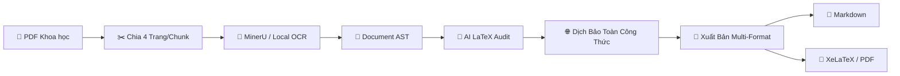

# ⚡ SciDoc OCR Studio — Scientific Document OCR & Publishing System

<div align="center">


### Hệ thống OCR Tài Liệu Khoa Học Đa Cột, Bóc Tách Công Thức Toán LaTeX, Dịch Thuật Bảo Toàn & Trợ Lý AI

[](https://www.python.org/)
[-green?logo=qt&logoColor=white)](https://pypi.org/project/PySide6/)
[](https://developer.nvidia.com/cuda-toolkit)
[](LICENSE)
[](tests/)

[3 Cách Khởi Chạy](#-3-cách-khởi-chạy-ứng-dụng) • [Cấu Hình & Page/Chunk](#-lưu-ý-về-phân-bổ-trang--chunk-page--chunk) • [Hướng Dẫn Cài Đặt](#-hướng-dẫn-cấu-hình-chi-tiết) • [Tính Năng](#-tính-năng-nổi-bật) • [Kiến Trúc Pipeline](#-kiến-trúc-hệ-thống--pipeline-xử-lý)

</div>

---

## 🚀 3 Cách Khởi Chạy Ứng Dụng

Bạn có thể lựa chọn 1 trong 3 cách khởi chạy tùy theo nhu cầu sử dụng:

### 👉 Cách 1: Sử dụng Trình Launcher EXE 1-Click (Khuyên dùng cho người dùng cuối ⭐)
*Không cần cài đặt Python thủ công, không cần gõ lệnh dòng lệnh.*

1. Vào mục [**Releases**](https://github.com/Stufusic/SciDocOCR/releases) của dự án và tải tệp **`SciDocOCR-Launcher.exe`** (dung lượng siêu nhẹ ~13 MB).
2. Đặt file vào thư mục dự án và **Double-click mở `SciDocOCR-Launcher.exe`**.
3. Cửa sổ Launcher thông minh sẽ hiện lên:
   - Tự động quét kiểm tra môi trường máy tính.
   - Bấm nút **"📦 Cài đặt / Cập nhật Thư viện"** để tự động tải các gói phụ thuộc qua công cụ `uv` siêu tốc (chỉ mất 5–10 giây).
   - Bấm **"🚀 Khởi chạy SciDoc OCR"** để mở ứng dụng chính!

---

### 👉 Cách 2: Chạy trực tiếp bằng Script `run.bat` (Dành cho người tải file ZIP Source Code)
*Dành cho người tải toàn bộ mã nguồn về máy.*

1. Tải file ZIP mã nguồn từ GitHub về và giải nén.
2. **Double-click vào tệp `run.bat`**.
3. Hệ thống sẽ tự động khởi động ứng dụng chính. Nếu phát hiện máy tính chưa có đủ thư viện phụ thuộc, script sẽ tự động kích hoạt trình Launcher đồ họa để hỗ trợ cài đặt.

---

### 👉 Cách 3: Chạy qua Dòng lệnh CLI (Dành cho Developer / Lập trình viên)
*Thao tác nhanh chóng qua môi trường dòng lệnh Terminal / CMD / PowerShell.*

```bash
# 1. Clone mã nguồn về máy
git clone https://github.com/Stufusic/SciDocOCR.git
cd SciDocOCR

# 2. Cài đặt các thư viện phụ thuộc bằng uv (siêu tốc) hoặc pip
pip install uv
uv pip install -r requirements.txt

# (Tùy chọn) Cài đặt MinerU Engine đầy đủ để chạy OCR cục bộ bằng GPU
uv pip install -U "mineru[all]"

# 3. Khởi chạy ứng dụng Studio
python -m app.main
```

---

## ⚙️ Lưu Ý Về Phân Bổ Trang / Chunk (Page / Chunk)

Tài liệu khoa học thường rất nặng, chứa hàng trăm công thức ma trận, tích phân và sơ đồ mạng. Để tối ưu hóa hiệu năng, hệ thống áp dụng cơ chế **Phân mảnh thông minh (Smart 4-Page Chunking)**:

```
Tài liệu 14 Trang  ➔  [Chunk 1: Tr 1-4]  +  [Chunk 2: Tr 5-8]  +  [Chunk 3: Tr 9-12]  +  [Chunk 4: Tr 13-14]
```

### 🎯 Tại sao lại chia theo Chunk?
1. **Chống tràn bộ nhớ GPU VRAM**: Các mô hình AI phân tích bố cục (YOLOv8) và nhận diện công thức (UniMERNet) ngốn nhiều VRAM nếu nạp 20–50 trang cùng lúc. Chia chunk giữ mức VRAM luôn ổn định dưới 6–8 GB.
2. **Khả năng chịu lỗi (Fault-Tolerance)**: Nếu 1 trang trong tài liệu gặp sự cố, các chunk còn lại vẫn được lưu nguyên vẹn vào bộ nhớ đệm Cache SHA-256.
3. **Tối ưu Timeout (600 giây)**: Mỗi chunk được cấp hạn mức thời gian xử lý lên tới 10 phút, đảm bảo ngay cả những trang toán học phức tạp nhất cũng được giải mã hoàn chỉnh.

### 📊 Bảng Khuyến Nghị Cấu Hình Phần Cứng:

| Cấu hình Phần cứng | Dung lượng VRAM | Khuyến nghị Chunk Size | Ghi chú |
| :--- | :--- | :---: | :--- |
| **Máy chỉ dùng CPU** | RAM 8GB–16GB | `2 – 4 trang` | Xử lý ổn định, tiết kiệm RAM |
| **GPU Laptop (RTX 3050 / 4050 / 4060)** | VRAM 4GB – 8GB | `4 trang (Mặc định)` | Tối ưu hóa tốc độ và bộ nhớ VRAM |
| **GPU Desktop Cao cấp (RTX 3090 / 4090)** | VRAM 16GB – 24GB | `8 – 12 trang` | Tốc độ xử lý hàng loạt siêu nhanh |

---

## 🛠️ Hướng Dẫn Cấu Hình Chi Tiết (Settings Guide)

Bạn có thể cấu hình nhanh các tham số qua giao diện **`⚙ Settings`** trên thanh công cụ:

```
┌──────────────────────────────────────────────────────────────────┐
│                     SciDoc OCR - Settings                        │
├──────────────────────────────────────────────────────────────────┤
│ AI Engine Mode:      [ Auto (Tự động nhận diện)               ▼] │
│ Translation Engine:  [ Google Translate (Miễn phí / Tốc độ cao)▼]│
│ Active Provider:     [ Google Gemini                          ▼] │
│ API Key:             [ AQ.Ab8RN6LTwkSbw9OBLMcKS7Kw7sJpn...    👁]│
│ Base URL:            [ https://generativelanguage.googleapis... ]│
│ Model:               [ gemini-2.5-flash                       ▼]│
│                                                                  │
│                     [✓ 50 models khả dụng]                       │
└──────────────────────────────────────────────────────────────────┘
```

### 1. Các Chế Độ Động Cơ AI (`AI Engine Mode`):
- **`Auto` (Mặc định - Khuyên dùng)**: Tự động phát hiện mạng và phần cứng. Ưu tiên GPU cục bộ, nếu không có sẽ tự động fallback qua API Online.
- **`MinerU`**: Sử dụng trực tiếp động cơ MinerU CLI cục bộ với tăng tốc NVIDIA CUDA GPU.
- **`LM Studio (Local Only)`**: Kết nối trực tiếp máy chủ LM Studio offline (`http://127.0.0.1:1234/v1`) bảo mật dữ liệu tuyệt đối.
- **`Online Only`**: Sử dụng hoàn toàn các mô hình đám mây (Gemini, GPT-4o, Claude).

### 2. Quản Lý Khóa API Đa Nhà Cung Cấp:
- Hỗ trợ nhập và lưu trữ độc lập khóa API cho **Google Gemini**, **OpenAI**, **Anthropic Claude**, và **OpenRouter / DeepSeek**.
- Khi chuyển đổi giữa các nhà cung cấp, khóa API và Base URL đã lưu **không bao giờ bị mất** và tự động đồng bộ vào tệp `.env`.
- Tự động kết nối trực tiếp đến máy chủ để lấy **toàn bộ danh sách model mới nhất đang hoạt động** (Live Model Discovery).

### 3. Động Cơ Dịch Thuật (`Translation Engine`):
- **`Google Translate`**: Dịch thuật tốc độ cực cao, hoàn toàn miễn phí, không yêu cầu API Key và không giới hạn Quota.
- **`AI LLM Translation`**: Dịch thuật nâng cao qua mô hình ngôn ngữ lớn kết hợp tự động tạo chú thích giải thích công thức toán học (`> 💡`).

---

## 🌟 Tính Năng Nổi Bật

- 🔬 **Nhận diện Bố cục Đa Cột & Bảng biểu**: Bóc tách tài liệu 2 cột, căn lề, hình vẽ và bảng biểu phức tạp.
- ➕ **Trích xuất Công thức LaTeX Chuyên sâu**: Nhận diện chính xác công thức toán trong dòng (`$x$`) và khối (`$$...$$`), kiểm tra cú pháp bằng SymPy.
- 🛡️ **Bảo toàn Công thức 100% khi Dịch thuật (`ProtectedBlockParser`)**: Tự động mã hóa toàn bộ `$$...$$`, `$x$`, `\cite{}`, `\ref{}` trước khi gửi dịch và đối soát khôi phục nguyên vẹn sau dịch.
- 💬 **Trợ lý AI Chat Assistant**: Khung chat tương tác trực tiếp theo ngữ cảnh PDF, hỗ trợ chọn model động và tự động lọc sạch các khối suy nghĩ nội bộ (`<think>`, `<thought>`).
- 📐 **Biên dịch Xuất bản Đa Định dạng**: Xuất file Markdown sạch, mã nguồn LaTeX (`.tex`) và tự động biên dịch tài liệu PDF chất lượng cao qua XeLaTeX.

---

## 🏗️ Kiến trúc Hệ thống & Pipeline Xử lý

> 📖 **Xem toàn bộ sơ đồ tuần tự (Sequence Diagram), sơ đồ lớp AST (Class Diagram) và chi tiết 7 giai đoạn xử lý tại:** [**PIPELINE.md**](PIPELINE.md)



---

## 📦 Hướng Dẫn Đóng Gói Phân Phối

Bạn có thể tự đóng gói ứng dụng thành file `.exe` cho Windows:

```bash
# 1. Đóng gói Launcher 1-Click siêu nhẹ (~13 MB):
python build_launcher.py

# 2. Đóng gói toàn bộ ứng dụng chính thành 1 file độc lập:
python build_exe.py
```
> Kết quả xuất bản sẽ nằm trong thư mục `dist/`.

---

## 💻 Yêu Cầu Hệ Thống (System Requirements)

- **Hệ điều hành**: Windows 10 / 11 (64-bit).
- **Python**: Python 3.11, 3.12 hoặc 3.13.
- **Bộ nhớ RAM**: Tối thiểu 8 GB RAM (Khuyến nghị 16 GB).
- **Card đồ họa (Tùy chọn)**: Hỗ trợ card NVIDIA (CUDA 12.x) để tăng tốc nhận diện công thức toán học.

---

## 📄 Bản quyền (License)

Dự án được phát hành theo giấy phép mã nguồn mở **[MIT License](LICENSE)**. Tự do sử dụng, tùy biến và phân phối cho mục đích học tập cũng như thương mại.