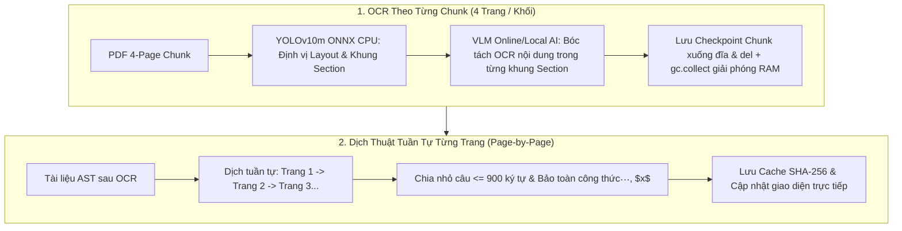

# ⚡ SciDoc OCR Studio — Scientific Document OCR & Publishing System

<div align="center">


### Hệ thống OCR Tài Liệu Khoa Học Đa Cột, Bóc Tách Công Thức Toán LaTeX, Dịch Thuật Bảo Toàn & Trợ Lý AI

[](https://github.com/Stufusic/SciDocOCR/releases)
[](https://www.python.org/)
[-green?logo=qt&logoColor=white)](https://pypi.org/project/PySide6/)
[-orange?logo=onnx&logoColor=white)](https://onnxruntime.ai/)
[](LICENSE)
[](tests/)

[⬇️ Tải Bản Release](#-tải-về-bản-phát-hành-mới-nhất-releases) • [Cài Đặt Nhanh](#-hướng-dẫn-cài-đặt--khởi-chạy-nhanh) • [Chế Độ CPU Only](#-dành-cho-máy-tính-không-có-gpu-nvidia-cpu-only-mode) • [Hướng Dẫn Sử Dụng](#-hướng-dẫn-sử-dụng-từng-bước-user-guide) • [Kiến Trúc Chunk & Dịch Trang](#-cơ-chế-xử-lý-chunk-ocr--dịch-thuật-từng-trang) • [Thử Nghiệm Bản PRO](#-thử-nghiệm-phiên-bản-nâng-cấp-scidoc-ocr-pro-studio-v102)

</div>

---

## ⬇️ Tải Về Bản Phát Hành Mới Nhất (Releases)

Bạn có thể tải ngay bản phát hành đóng gói sẵn cho Windows:

* 📦 **Tải Bản Release Chính Thức:** [**SciDoc OCR Studio Releases on GitHub**](https://github.com/Stufusic/SciDocOCR/releases)
* 🚀 **Trình Khởi Chạy Nhanh:** Tải file `SciDocOCR_Launcher.exe` hoặc file nén `SciDocOCR_Windows.zip`, giải nén và mở trực tiếp để sử dụng ngay!

---

## 🚀 Hướng Dẫn Cài Đặt & Khởi Chạy Nhanh

Bạn có thể lựa chọn 1 trong 3 cách sau để bắt đầu:

### 👉 Cách 1: Khởi chạy 1-Click bằng Script `run.bat` (Khuyên dùng nhất ⭐)
*Tiện lợi, an toàn, tự động kiểm tra thư viện và nạp môi trường tối ưu.*

1. Tải mã nguồn về máy: Bấm nút xanh **`Code`** ở đầu trang ➔ Chọn **`Download ZIP`** (hoặc Clone Git) và giải nén ra một thư mục.
2. **Double-click vào tệp `run.bat`**.
3. Giao diện **Setup Wizard / Smart Launcher** sẽ tự động mở lên với các tùy chọn tiện ích:
   - **`📦 Cài đặt CPU (Không cần GPU)`**: Dành cho laptop văn phòng, máy không có card rời (cài đặt siêu tốc trong vài giây).
   - **`⚡ Cài đặt GPU (MinerU CUDA)`**: Dành cho máy tính có card đồ họa rời NVIDIA.
   - **`📥 Tải Model YOLOv10 (~60MB)`**: Tải model thị giác SOTA bóc tách bố cục và công thức toán trực tiếp từ CDN/HuggingFace về máy.
   - **`🚀 Khởi chạy SciDoc OCR`**: Tự động tạo biểu tượng **Desktop Shortcut** và mở ứng dụng ngay!

---

### 👉 Cách 2: Sử Dụng Setup Wizard / Launcher (.exe)
*Dành cho người dùng thích cài đặt qua giao diện đồ họa chuẩn Windows.*

1. Tải file `SciDocOCR_Launcher.exe` từ [GitHub Releases](https://github.com/Stufusic/SciDocOCR/releases).
2. Mở file để khởi chạy Setup Wizard.
3. Bấm **Tải Model YOLOv10 ONNX** để chuẩn bị động cơ thị giác offline, sau đó bấm **Khởi chạy**.

---

### 👉 Cách 3: Chạy qua Dòng lệnh CLI (Dành cho Developer / Lập trình viên)
*Thao tác nhanh chóng qua Terminal / CMD / PowerShell.*

```bash
# 1. Clone mã nguồn về máy
git clone https://github.com/Stufusic/SciDocOCR.git
cd SciDocOCR

# 2. Cài đặt các gói phụ thuộc (Khuyên dùng uv để đạt tốc độ tối đa):
pip install uv
uv pip install -r requirements.txt

# (Tùy chọn) Cài đặt thêm MinerU GPU Engine nếu có card NVIDIA:
uv pip install -U "mineru[all]"

# 3. Khởi chạy ứng dụng Studio
python -m app.main
```

---

## 💻 Dành Cho Máy Tính Không Có GPU NVIDIA (CPU-Only Mode)

Nếu máy tính của bạn là **Laptop văn phòng, PC chỉ dùng CPU Intel / AMD hoặc card đồ họa onboard (iGPU)**, bạn **hoàn toàn yên tâm sử dụng 100% đầy đủ các tính năng** của SciDoc OCR Studio nhờ kiến trúc phân tầng tối ưu:

### 🌟 Các Tính Năng Hoạt Động Hoàn Hảo Trên Máy CPU:
1. **⚡ Định Vị Bố Cục Bằng YOLOv10m ONNX Trên CPU (Theo Từng Chunk)**:
   - Sử dụng kiến trúc **NMS-Free** của YOLOv10m kết hợp `onnxruntime` (`CPUExecutionProvider`) để phân vùng Layout (Section, Heading, Paragraph, Table, Formula) cho từng trang trong chunk với tốc độ siêu nhanh **~25ms – 40ms / trang**.
   - Nếu chưa tải file ONNX, hệ thống tự động fallback sang thuật toán **CV & Typography Heuristic Engine** có sẵn trong app $\rightarrow$ không bao giờ bị lỗi thiếu file.
2. **🤖 Bóc Tách OCR Chuyên Sâu Bằng VLM (Online API hoặc Local Model)**:
   - Các khung Section được chuyển tới mô hình Vision-Language (Google Gemini, OpenAI GPT-4o, Claude hoặc MinerU/LM Studio Local) để **chỉ tập trung OCR giải mã nội dung và công thức LaTeX** trong từng khung Section đó, trả về kết quả cấu trúc chuẩn xác theo từng chunk.
3. **🌐 Dịch Thuật Tuần Tự Từng Trang (Page-by-Page Sequential Translation)**:
   - Dịch tuần tự từng trang một (Page 1 $\to$ Page 2 $\to$ ...), tự động chia nhỏ câu ($\le 900$ ký tự) tránh lỗi HTTP 414 và bảo vệ tuyệt đối 100% công thức toán học (`$$...$$`, `$x$`).
4. **📐 Xuất Bản Markdown, Mã Nguồn LaTeX & PDF Chất Lượng Cao**:
   - Tự động sinh file `.md`, `.tex` chuẩn hóa và biên dịch PDF qua XeLaTeX hoặc ReportLab PDF Fallback Engine tích hợp sẵn.

---

## 📖 Hướng Dẫn Sử Dụng Từng Bước (User Guide)

Giao diện Studio được thiết kế theo cấu trúc 3 khung nhìn trực quan (**Triple-Pane Workspace**): Cây thư mục dự án (bên trái), Trình xem tài liệu PDF (ở giữa) và Trình biên tập Markdown / LaTeX / Chat Assistant (bên phải).

```
┌──────────────┬────────────────────────┬──────────────────────────────────────┐
│  Dự Án (Tree)│   Trình Xem PDF Gốc    │  Markdown  │  LaTeX  │ 💬 AI Assistant│
├──────────────┼────────────────────────┼──────────────────────────────────────┤
│ 📄 Page 1    │                        │                                      │
│ 📄 Page 2    │  [Hiển thị trang PDF   │  [Văn bản bóc tách & công thức toán  │
│ 📄 Page 3    │   kèm khung nhận diện] │   hiển thị trực tiếp theo thời gian  │
│ ...          │                        │   thực kèm hình ảnh và bảng biểu]    │
└──────────────┴────────────────────────┴──────────────────────────────────────┘
```

### Bước 1: Mở File PDF Khoa Học
- Bấm vào nút **`📁 Open PDF`** trên thanh công cụ (Toolbar) và chọn tệp PDF cần xử lý.
- Hệ thống sẽ tự động tạo không gian làm việc và nạp các trang tài liệu vào danh sách.

### Bước 2: Bóc Tách Bố Cục & OCR Theo Chunk (`⚡ Process All`)
- Bấm vào nút **`⚡ Process All`** trên thanh công cụ.
- Hệ thống thực thi theo **Mô hình Pipeline 2 Tầng Theo Chunk**:
  1. **YOLOv10m ONNX (CPU)** quét từng trang trong chunk để đóng khung chính xác tọa độ các Section, Bảng biểu, Hình ảnh và Công thức.
  2. Gửi các vùng khung Section tới **VLM (Online API / Local Model)** để OCR giải mã chữ viết và công thức LaTeX chuyên sâu.
  3. Lưu kết quả chunk xuống đĩa, render ảnh preview và gọi `gc.collect()` giải phóng RAM ngay trước khi chuyển sang chunk tiếp theo.

### Bước 3: Dịch Thuật Tuần Tự Từng Trang (`🌐 Translate`)
- Bấm vào nút **`🌐 Translate`** trên thanh công cụ:
  - Hệ thống tiến hành **dịch tuần tự từng trang một (Page-by-Page)** theo luồng queue nhẹ nhàng.
  - Toàn bộ công thức toán học (`$$...$$`, `$x$`), code và trích dẫn được bảo vệ nguyên vẹn qua bộ đệm SHA-256.

### Bước 4: Tương Tác Với Trợ Lý AI Hỏi Đáp (`💬 AI Assistant`)
- Chuyển sang tab **`💬 AI Assistant`** ở khung bên phải:
  1. Chọn **Nhà cung cấp (Provider)**: Google Gemini, LM Studio (Local), OpenAI, Anthropic Claude, OpenRouter, hoặc Custom API.
  2. Hệ thống **tự động kết nối trực tiếp đến API để nạp toàn bộ danh sách mô hình mới nhất** vào thanh cuộn.
  3. Bấm **`⚙ API/URL`** nếu bạn muốn xem hoặc dán nhanh API Key / Base URL trực tiếp trong khung chat.
  4. Đặt câu hỏi về nội dung tài liệu, giải thích công thức toán hoặc yêu cầu tóm tắt.

### Bước 5: Soát Lỗi Công Thức (`🔍 Review Mode`)
- Nếu tài liệu có công thức chất lượng scan kém, nút **`🔍 Review (N)`** ở thanh trạng thái sẽ sáng lên.
- Mở cửa sổ đối soát để so sánh ảnh gốc với mã LaTeX nhận diện được và tùy chỉnh nếu cần.

### Bước 6: Xuất Bản Đa Định Dạng (`📤 Export...`)
- Bấm vào nút **`📤 Export...`** trên thanh công cụ:
  - **Markdown (`.md`)**: Kèm toàn bộ thư mục hình ảnh `images/`.
  - **LaTeX Source (`.tex`)**: Mã nguồn LaTeX chuẩn hóa với các gói `amsmath`, `amssymb`, `graphicx`.
  - **Tài liệu PDF (`.pdf`)**: Tự động biên dịch qua XeLaTeX hoặc bộ tạo PDF tích hợp sẵn.

---

## ⚙️ Cơ Chế Xử Lý Chunk OCR & Dịch Thuật Từng Trang

Để tối ưu hóa hiệu năng, chống tràn RAM và không bị nghẽn mạng, kiến trúc hệ thống phân tách rõ ràng:



### 🎯 Ưu Điểm Của Cơ Chế Này:
1. **YOLOv10m dẫn đường cho VLM**: Thay vì để VLM tự đoán vị trí (dễ bị sai thứ tự đọc), YOLOv10m chạy trên CPU định vị sẵn từng khung Section, VLM chỉ việc đọc nội dung trong khung đó $\rightarrow$ độ chính xác đạt mức cao nhất.
2. **Quản lý RAM theo Chunk**: Mỗi chunk sau khi hoàn tất bóc tách sẽ giải phóng toàn bộ tensors và buffer thô (`gc.collect()`), giúp xử lý tài liệu hàng trăm trang mà RAM không bao giờ bị tăng đột biến.
3. **Dịch theo Trang độc lập**: Tách biệt khâu dịch ra từng trang giúp tránh lỗi nghẽn đường truyền HTTP 414, không lo dính rate-limit của dịch vụ dịch thuật và có thể xem kết quả dịch của trang ngay lập tức.

---

## 🛠️ Hướng Dẫn Cấu Hình Chi Tiết (Settings Guide)

Trong giao diện **`⚙ Settings`**:

### 1. Nhóm Động Cơ Cục Bộ (🏠 Local AI & Offline Engine):
- **LM Studio (Local LLM)**: Endpoint mặc định `http://127.0.0.1:1234/v1` cho phép chat và dịch thuật offline 100%.
- **MinerU Engine (Local Server & CLI)**:
  - Cổng Server Local mặc định: `http://127.0.0.1:8000` (có nút **🔌 Test Port** kiểm tra tức thì).
  - Hoặc chọn đường dẫn CLI (`magic-pdf.exe` / `mineru.exe`) bằng nút **📁 Browse** hoặc **🔍 Auto-Detect**.
- **Model YOLOv10 ONNX**: Hiển thị trạng thái model trên CPU và nút **📥 Tải Model YOLOv10 (~60MB)** trực tiếp từ CDN.

### 2. Nhóm Động Cơ Đám Mây (🌐 Online Cloud API Engine):
- Hỗ trợ nhập và lưu trữ độc lập khóa API cho từng nhà cung cấp: **Google Gemini**, **OpenAI**, **Anthropic Claude**, **OpenRouter**, **Custom OpenAI-Compatible API**.
- Tự động quét và nạp danh sách model thời gian thực (Live Model Discovery).

### 3. Động Cơ Dịch Thuật (`Translation Engine`):
- **`Google Translate`**: Miễn phí, tốc độ cực nhanh, chia nhỏ câu $\le 900$ ký tự chống lỗi HTTP 414.
- **`AI LLM Translation`**: Dịch chuyên sâu kết hợp tự động sinh ghi chú giải thích công thức toán học (`> 💡`).

---

## 💻 Yêu Cầu Hệ Thống (System Requirements)

- **Hệ điều hành**: Windows 10 / 11 (64-bit).
- **Python**: Python 3.11, 3.12 hoặc 3.13.
- **Bộ nhớ RAM**: Tối thiểu 4 GB RAM (Khuyến nghị 8 GB – 16 GB).
- **Card đồ họa (Tùy chọn)**: Hỗ trợ card NVIDIA (CUDA 12.x) nếu muốn tăng tốc nhận diện qua MinerU GPU. Chế độ CPU tiêu chuẩn không yêu cầu card rời.

---

## 🌟 Thử Nghiệm Phiên Bản Nâng Cấp: SciDoc OCR PRO Studio (v1.0.2)

Nếu bạn muốn trải nghiệm phiên bản nâng cấp thế hệ mới với giao diện đồ họa hiện đại, công nghệ AI Vision đa phương thức và bộ cài đặt Windows Setup Wizard chạy thuần máy tính (Zero-Port Native App):

* ⬇️ **Tải Bản Cài Đặt Setup Windows (.exe):** [Release SciDoc OCR PRO Studio (exe) v1.0.2 - Windows Release](https://github.com/Stufusic/SciDocOCR/releases/tag/v1.0.2)
* 📦 **Kho Mã Nguồn Bản PRO:** [https://github.com/Stufusic/SciDocOCR_Pro](https://github.com/Stufusic/SciDocOCR_Pro)

### 💎 Các Tính Năng Nổi Bật Bản PRO (v1.0.2):
1. **🖥️ Kiến Trúc Native Desktop App (Zero-Port JS Bridge IPC):** Chạy trực tiếp 100% trong bộ nhớ máy tính qua JS Bridge IPC (`window.pywebview.api`), không mở cổng Port, không dùng máy chủ web, triệt tiêu 100% lỗi mạng và firewall.
2. **📦 Trình Cài Đặt 1-Click Setup Wizard (`SciDocOCR_Pro_Setup_v1.0.2.exe`):** Tải về, bấm Next $\to$ Finish là app tự động chạy mượt mà ngay trên máy.
3. **👁️ YOLOv8 DocLayNet & UniMERNet ONNX Engine:** Bóc tách bố cục chuẩn 11 phân lớp quốc tế và giải mã công thức toán học chuyên sâu siêu nét bằng trích xuất vector 450+ DPI.
4. **⚡ Xử Lý Toàn Bộ Tự Động (Batch Process All Chunks):** Thanh tiến trình hiển thị realtime tiến độ, xử lý tuần tự (Streaming Queue) và tự động giải phóng bộ nhớ RAM (`del` & `gc.collect()`) sau mỗi chunk.
5. **🎯 Tương Tác Hai Chiều PDF ↔ Markdown:** Click vào bất kỳ vùng Section/BBox trên PDF sẽ tự động cuộn mượt và phát sáng khối Markdown tương ứng.
6. **⌨️ & 🖱️ Điều Hướng Trang Linh Hoạt:** Chuyển trang nhanh chóng bằng phím mũi tên (`←`/`→`), `PageUp`/`PageDown`, `Home`/`End` hoặc cuộn con lăn chuột.
7. **✂️ Phân Tách 3 Trang Thông Minh & Tự Phục Hồi (Adaptive 3-Page Chunking & Checkpoints):** Tối ưu hóa ngữ cảnh và bộ nhớ, tự lưu & khôi phục checkpoint từng khối.
8. **🌐 Dịch Thuật Chuyên Ngành Song Ngữ (Dual-View Bilingual Translation):** Đối sánh trực quan bản gốc & bản dịch Tiếng Việt, bảo toàn 100% công thức toán học.
9. **🤖 Tích Hợp Đa Nhà Cung Cấp LLM AI & Live Model Discovery:** Kết nối Google Gemini, OpenAI, Claude, OpenRouter, Local AI với tính năng Fetch Models tự động.
10. **📊 Bóc Tách Bảng Biểu Chuẩn Quốc Tế (Booktabs):** Tái tạo bảng số liệu sang cả Markdown và mã nguồn LaTeX chuẩn mực.

---

### 🔑 Hướng Dẫn Lấy & Cấu Hình API Key Cho Các LLM AI:
* **Google Gemini API Key (Miễn phí 100% ⭐):** Truy cập [Google AI Studio (https://aistudio.google.com/)](https://aistudio.google.com/) ➔ Bấm **Get API key** ➔ Tạo key và dán vào ô **Google API Key** trong phần Cài đặt của ứng dụng.
* **OpenRouter API Key (Truy cập 200+ Model: DeepSeek-R1, Qwen, Claude):** Truy cập [OpenRouter Keys (https://openrouter.ai/keys)](https://openrouter.ai/keys) ➔ Tạo key và dán vào ô **OpenRouter API Key** trong ứng dụng.
* **OpenAI API Key (GPT-4o, o3-mini):** Truy cập [OpenAI Platform (https://platform.openai.com/api-keys)](https://platform.openai.com/api-keys) ➔ Tạo key và dán vào ô **OpenAI API Key**.
* **Anthropic Claude API Key (Claude 3.7 Sonnet):** Truy cập [Anthropic Console (https://console.anthropic.com/)](https://console.anthropic.com/) ➔ Lấy key và dán vào ô **Anthropic API Key**.
* **Local AI Offline (Ollama / LM Studio - Không cần Key):** Điền Base URL `http://127.0.0.1:11434/v1` (Ollama) hoặc `http://127.0.0.1:1234/v1` (LM Studio).

---

## 📄 Bản quyền (License)

Dự án được phát hành theo giấy phép mã nguồn mở **[MIT License](LICENSE)**. Tự do sử dụng, tùy biến và phân phối cho mục đích học tập cũng như thương mại.
